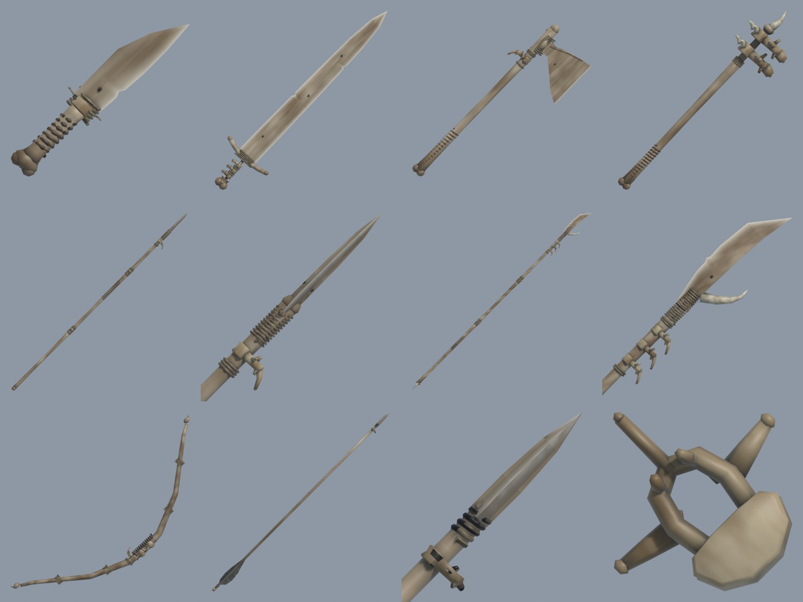

# Skeleton weapons v1 (archived 2026-09-29)

The first all-bone skeleton arsenal: a dagger, sword, axe, mace, spear, atgeir, bow and arrow for the game's Skeleton,
each with a vertebra worked in, and the vertebra drop (`ecp_vertebra`). Kept as it was when the user asked for a new
set; the live set is built from `assets/ecp_skel_*` and `assets/ecp_skel_arsenal` (see the workshop README).



| Weapon | Made of | Its vertebra |
| --- | --- | --- |
| Dagger | seax blade ground from bone, finger-bone handle, knuckle pommel | the guard: wings as quillons, spine as a thumb spur |
| Sword | broad flat bone blade, rib crossguard, knuckle pommel | three stacked on the core as the grip |
| Axe | shoulder-blade head on a femur haft | a collar under the head |
| Mace | femur haft | the head: two beast vertebrae set with fangs |
| Spear | three long bones jointed with sinew, a bone leaf point | a collar under the point, wings as lugs |
| Atgeir | three jointed long bones, a curved rib blade, a fang hook | a column of three under the head |
| Bow | two ribs for limbs, finger-bone nocks | the arrow shelf above the grip |
| Arrow | bone shaft, bone point, dark feathers | a bead behind the point |

## What is here

```
skeleton_weapons_v1/
  README.md, sheet.jpg
  source/                 the model.py of each piece and the shared code (ecp_skel_arsenal/grave_*.py, scripts),
                          laid out like assets/ so they build from here; unity_SkelArsenal/ the Unity bake code of then
  out/ (not committed)    models/<piece>/  the built FBX, textures, .blend and preview of each piece
                          showcase/        the baked showcase: skeleton_arsenal.blend (caches beside it, images packed)
                          bundles/         ecp_skel_arsenal.windows / .linux as built then
                          renders/         arsenal_sheet.png and its tiles
```

Watch the showcase (the game's Skeletons doing each weapon's attack):

```
blender assets/skeleton_weapons_v1/out/showcase/skeleton_arsenal.blend --python assets/skeleton_weapons_v1/out/showcase/blender_play.py
```

Rebuild a piece from here (its prefab name is the folder name, the same as the live set's):

```
.\build.ps1 -Asset skeleton_weapons_v1\source\ecp_skel_dagger
```
